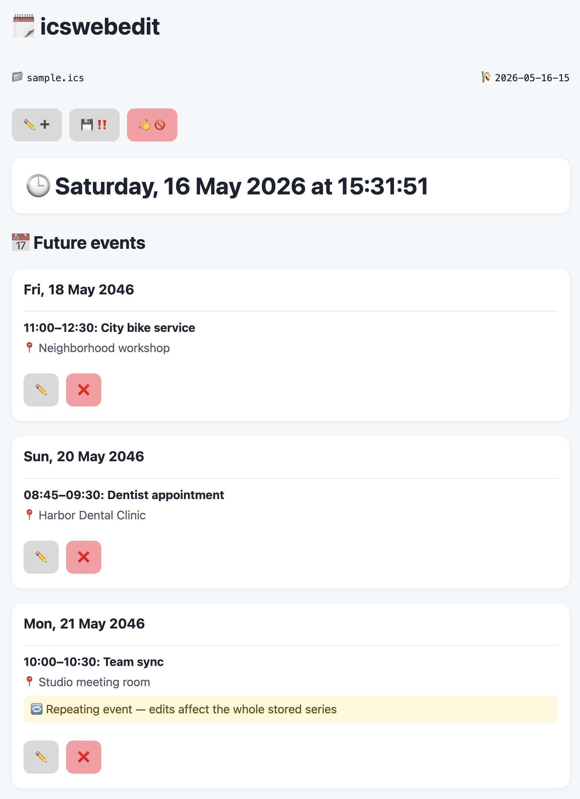
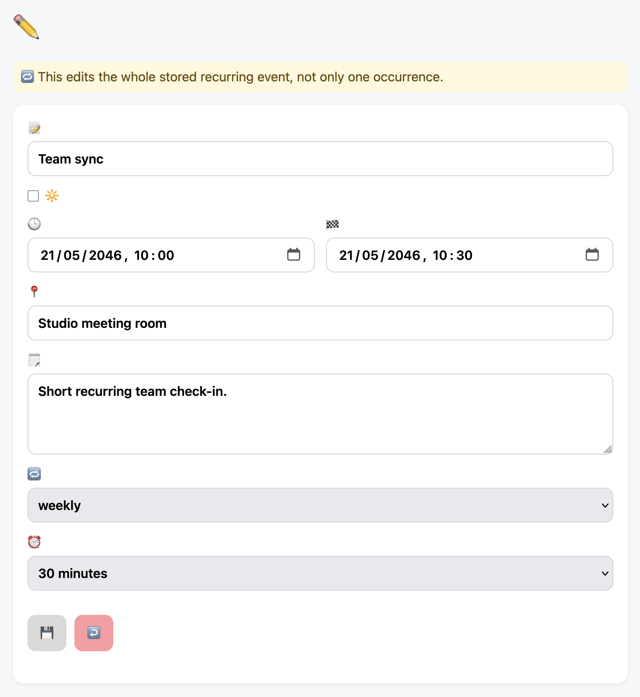

# icswebedit

> [!WARNING]
> **Big disclaimer:** this project was vibe coded by OpenAI's assistant.
> It may contain mistakes, rough edges, incomplete behavior, weak validation,
> incorrect assumptions about timezones or recurrence, and untested platform
> details. Do not trust it blindly with important calendar data. Review the
> code, test it on copies of your `.ics` files, and keep backups.

`icswebedit` is a tiny local web app for editing one `.ics` calendar file in a
browser.

## Preview

### Overview



### Details



## What it does

- runs as a single-file script via `pipx run`
- serves a local browser UI on `127.0.0.1`
- edits a temporary session first
- only writes the real `.ics` file when you press **Save**

## Features

- local-only browser UI bound to `127.0.0.1`
- single-file executable script with `pipx run`
- add, edit, and delete calendar events
- timed and all-day event support
- recurring event support with simple frequency dropdowns:
  - daily
  - weekly
  - monthly
- alarm lead-time dropdown for common reminder offsets
- browser-local editing for timed events, stored back as UTC in the ICS file
- live digital home-page clock with browser-local date and time formatting
- future-only overview for one-off events
- next-due-only overview for recurring events
- recurring edits always apply to the whole stored series
- temporary session file so the original calendar is unchanged until **Save**
- automatic backup creation on save
- automatic cleanup of past non-recurring events on save
- recurring events are never auto-deleted
- automatic browser-language translations with no language menu required
- simple macOS Shortcut / Dock-launch workflow
- initial dark-mode support based on the system theme at page load
- emoji-heavy interface with lightweight styling

## Supported languages

The UI uses the browser language automatically. There is no manual language
switcher.

Built-in translations are provided for:

- English
- German
- Spanish
- Dutch
- Italian
- French
- Portuguese
- Chinese
- Japanese
- Korean
- Russian
- Arabic
- Hindi

## Requirement

- `pipx`

## Run

```sh
pipx run ./icswebedit /path/to/calendar.ics
```

If you want to try the included sample calendar first:

```sh
cp example.ics sample.ics
pipx run ./icswebedit sample.ics
```

Optional port:

```sh
pipx run ./icswebedit /path/to/calendar.ics 8765
```

When it starts, it prints one local listening message such as:

```text
Listening on http://127.0.0.1:8765/
```

Open that URL in your browser.

## Data safety

- edits go to a temporary session file first
- the original calendar is untouched until **Save**
- saving creates a backup before replacing the original file
- on **Save**, old past non-recurring events are automatically removed from the
  `.ics` file to keep it tidy and to stop it growing forever
- recurring events are never auto-deleted
- recurring events do not support `COUNT`; if a recurring series is no longer
  needed, you must delete it yourself eventually
- the bundled `example.ics` and `sample.ics` reflect this by using open-ended
  recurring rules instead of `COUNT`
- you should still make your own backups

## macOS Shortcut / Dock icon

All hardcoded values below are examples. Replace them with your own calendar
path and preferred port.

Create a Shortcut in the Shortcuts app with these actions:

1. **Run Shell Script**
2. **Open URLs**

Use this shell script in **Run Shell Script**:

```sh
SCRIPT="$HOME/.sources/github.com/example/icswebedit/icswebedit"
ICS="$HOME/Calendars/personal-calendar.ics"
PORT=8765
URL="http://127.0.0.1:$PORT/"

if ! nc -z 127.0.0.1 "$PORT" >/dev/null 2>&1; then
    nohup "$SCRIPT" "$ICS" "$PORT" >/dev/null 2>%1 &
    sleep 1
fi

open "$URL"  
```

Configure **Open URLs** with:

```text
http://127.0.0.1:8765/
```

To get a Dock icon:

1. Open the Shortcut.
2. Use the Shortcut details/share menu.
3. Choose **Add to Dock**.

This creates a Dock icon that launches the Shortcut without showing Terminal.

## Spec

Detailed behavior and constraints live in [`SPEC.md`](SPEC.md).
